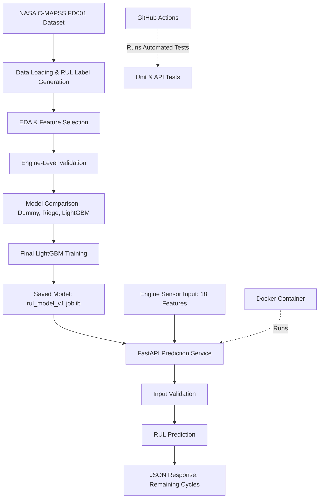

# Aircraft Engine Remaining Useful Life Prediction

An end-to-end machine learning project that predicts aircraft engine Remaining Useful Life (RUL) using NASA C-MAPSS simulated turbofan engine degradation data.

The project covers data analysis, model training, evaluation, REST API development, automated testing, and Docker containerization.

## 1. Problem Statement

Predictive maintenance aims to estimate when equipment may require maintenance before failure occurs.

This project estimates the number of operating cycles remaining for an aircraft engine using its operating conditions and sensor measurements.

The system is a research and portfolio prototype, not a validated aircraft maintenance system.

## 2. Tech Stack

- Python 3.11
- Pandas and NumPy
- Scikit-learn
- LightGBM
- FastAPI and Pydantic
- Pytest
- Docker and Docker Compose
- GitHub Actions


## Project Architecture


## 3. Dataset

Dataset: NASA C-MAPSS (FD001)

Training dataset:
- 100 engines
- 20,631 observations
- 21 sensor measurements
- 3 operational settings

The FD001 subset represents simulated engine degradation under one operating condition and one fault mode.

Raw dataset files are not included in this repository.

Download the NASA C-MAPSS dataset and place the following files in `data/raw/`:

- train_FD001.txt
- test_FD001.txt
- RUL_FD001.txt

## 4. Machine Learning Approach

The project follows these steps:

1. Load and analyze engine sensor data.
2. Calculate training RUL labels.
3. Identify and exclude constant features.
4. Perform engine-level validation.
5. Train Dummy, Ridge, and LightGBM regressors.
6. Evaluate models using MAE and RMSE.
7. Train the frozen LightGBM configuration on all training engines.
8. Evaluate on NASA's separate FD001 test set.

The final Version 1 model uses 18 input features.

## 5. Model Performance

NASA FD001 held-out test evaluation:

| Metric | Result |
|---|---:|
| Test engines | 100 |
| MAE | 19.04 cycles |
| RMSE | 26.33 cycles |

One prediction is generated per test engine using its final available observation.

These results apply to Version 1. The test set was used for its held-out evaluation and should not be treated as untouched for future tuning.

## 6. Installation

Clone the repository:

```bash
git clone https://github.com/CodeByHer0407/engine-rul-prediction.git

cd engine-rul-prediction
```

Create a Python 3.11 environment and activate it.

Install the dependencies:

```bash
python -m pip install -r requirements.txt
```

Download and extract the NASA dataset into `data/raw/` as described above.

## 7. Model Training

Train the LightGBM model:

```bash
python -m src.train
```

This generates:

`models/rul_model_v1.joblib`

The model artifact is excluded from GitHub and must be generated locally before running the prediction service.

## 8. Run the FastAPI Application

Start the application:

```bash
python -m uvicorn src.api:app --reload
```

Open Swagger UI:

http://127.0.0.1:8000/docs

Available endpoints:

- GET /health
- POST /predict

The prediction endpoint accepts 18 input features and returns estimated RUL in operating cycles.

## 9. Docker

First generate the model artifact using the training instructions.

Build and start the container:

```bash
docker compose up -d --build
```

Access the API:

http://127.0.0.1:8000/docs

Docker Compose mounts the locally generated model artifact into the container.

## 10. Automated Testing

Run the test suite:

```bash
python -m pytest tests/ -v
```

Tests cover input validation, feature ordering, prediction clipping, API responses, and real-model integration.

GitHub Actions automatically runs tests on pushes and pull requests targeting main.

The current CI workflow runs 16 unit/API tests. The real-model integration test is skipped in CI because its dataset and model artifact are not available there.

## 11. Limitations

- Uses simulated engine degradation data.
- Uses current-cycle measurements rather than complete historical sequences.
- Some engines exhibit substantial individual prediction errors.
- Model artifacts are generated locally.
- The system is not validated for safety-critical maintenance decisions.

## 12. Future Improvements

- Historical sensor feature engineering.
- Model performance monitoring.
- Model version management.
- Deployment enhancements.